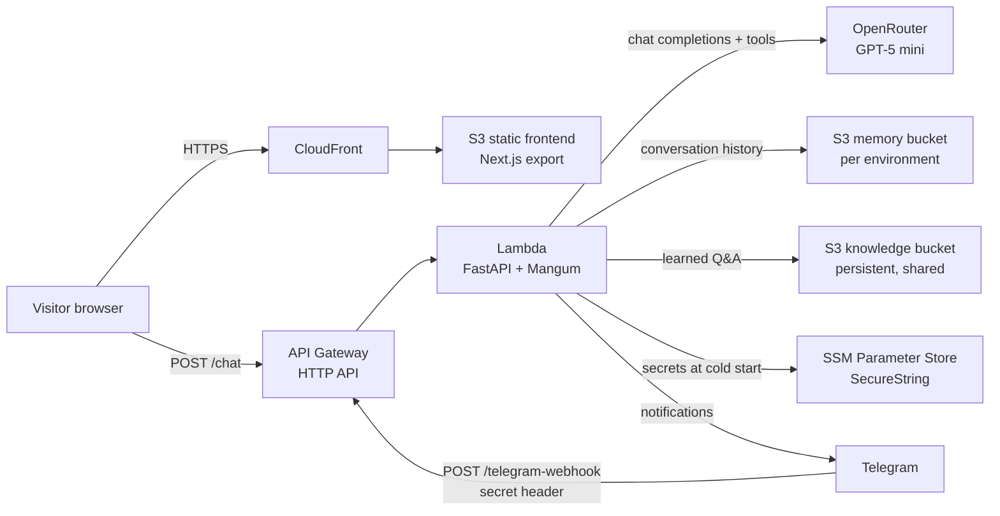
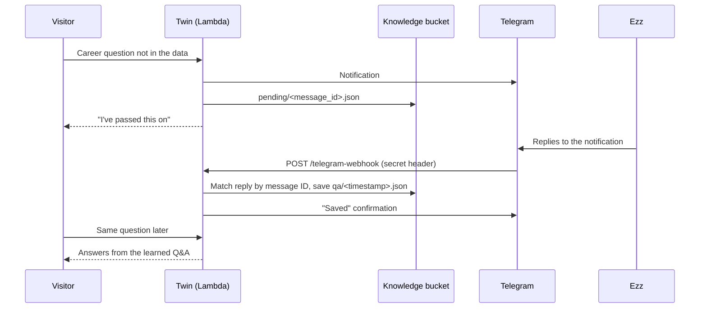

# AI Digital Twin

A serverless, production-style AI "digital twin" that represents Ahmed Ezzeldeen (Ezz) on his personal website. Visitors can ask about his career, skills and experience. The twin answers in his voice using only verified information, escalates questions it cannot answer to Ezz over Telegram, and **learns** from his replies.

The whole stack runs on AWS, is defined in Terraform, and is deployed through GitHub Actions with keyless OIDC authentication.

---

## Table of Contents

- [Features](#features)
- [Architecture](#architecture)
- [Tech Stack](#tech-stack)
- [Repository Structure](#repository-structure)
- [How It Works](#how-it-works)
- [Security Design](#security-design)
- [Prerequisites](#prerequisites)
- [One-Time Setup](#one-time-setup)
- [Local Development](#local-development)
- [Deployment](#deployment)
- [Configuration Reference](#configuration-reference)
- [Operations](#operations)
- [Troubleshooting](#troubleshooting)
- [Cost](#cost)

---

## Features

- **Grounded answers.** The twin answers from Ezz's resume, LinkedIn profile, summary and style notes, plus previously answered questions. The system prompt forbids inventing stories, opinions or numbers.
- **Unknown-question escalation.** When a career question can't be answered from the available data, the twin records it and sends it to Ezz on Telegram.
- **Learning loop.** When Ezz replies to that Telegram message, the answer is saved to a persistent knowledge store and used in all future conversations, with no redeploy.
- **Lead capture.** Visitors who want to get in touch can leave an email address. It's checked for a valid format and a domain that receives email, then forwarded to Ezz on Telegram.
- **Conversation memory.** Each chat session's history is stored in S3, so the twin keeps context across messages.
- **Infrastructure as code.** Every environment (`dev`, `test`, `prod`) is fully reproducible with Terraform and isolated by workspace.
- **CI/CD.** A push to `main` builds and deploys automatically. Environments can be deployed or destroyed from the GitHub Actions UI.

---

## Architecture



| Component | Purpose | Lifecycle |
|---|---|---|
| CloudFront + S3 (frontend) | Serves the static Next.js site | Per environment, managed by Terraform |
| API Gateway (HTTP API) | Public API with throttling (`/chat`, `/health`, `/telegram-webhook`) | Per environment, managed by Terraform |
| Lambda (Python 3.12) | FastAPI backend: prompt building, LLM calls, tools, webhook | Per environment, managed by Terraform |
| S3 memory bucket | Conversation history and per-session notification counters | Per environment, emptied on destroy |
| S3 knowledge bucket | Questions answered by Ezz via Telegram | Created once by hand; **survives destroy** |
| SSM Parameter Store | OpenRouter API key, Telegram bot token, webhook secret, chat ID | Created once by hand; **survives destroy** |
| S3 state bucket | Terraform remote state with S3-native locking | Created once by hand |

---

## Tech Stack

| Layer | Technology |
|---|---|
| Frontend | Next.js 16 (static export), React 19, Tailwind CSS, TypeScript |
| Backend | Python, FastAPI, Mangum (Lambda adapter), OpenAI Python SDK, dnspython |
| LLM | `openai/gpt-5-mini` via [OpenRouter](https://openrouter.ai), with tool calling and configurable reasoning effort |
| Infrastructure | Terraform (AWS provider 6.x), S3 backend with `use_lockfile` |
| AWS services | Lambda, API Gateway, CloudFront, S3, SSM Parameter Store, IAM |
| CI/CD | GitHub Actions with OIDC (no long-lived AWS keys) |
| Notifications | Telegram Bot API (outgoing messages + incoming webhook) |
| Tooling | `uv` (Python), Docker (Lambda-compatible packaging), Node.js 20 |

---

## Repository Structure

```
.
├── backend/
│   ├── server.py              # FastAPI app: /chat, /health, /telegram-webhook, tool loop
│   ├── context.py             # System prompt (grounding rules, style, learned Q&A, tool rules)
│   ├── resources.py           # Loads resume, LinkedIn, summary, facts and style from data/
│   ├── tools.py               # LLM tools, Telegram sender, per-session notification limit
│   ├── knowledge.py           # Learned Q&A store (S3 in AWS, local folder in development)
│   ├── ssm_secrets.py         # Reads secrets from .env locally or SSM Parameter Store on Lambda
│   ├── lambda_handler.py      # Mangum entry point for Lambda
│   ├── deploy.py              # Builds lambda-deployment.zip inside the Lambda Docker image
│   ├── requirements.txt       # Lambda runtime dependencies
│   ├── pyproject.toml         # Local development dependencies (uv)
│   └── data/                  # Source of truth for the twin's knowledge
├── frontend/
│   ├── app/                   # Next.js app router (layout, page, styles)
│   ├── components/twin.tsx    # Chat UI
│   └── public/                # Static assets (avatar)
├── terraform/
│   ├── main.tf                # All AWS resources
│   ├── veriables.tf           # Input variables
│   ├── terraform.tfvars       # Default values (model, reasoning effort, limits)
│   ├── outputs.tf             # URLs and resource names
│   ├── backend.tf             # S3 remote state (configured by the scripts)
│   └── versions.tf            # Terraform and provider versions
├── scripts/
│   ├── deploy.sh / .ps1       # Build backend, terraform apply, build and upload frontend
│   ├── destroy.sh / .ps1      # Empty buckets and terraform destroy
│   └── set_telegram_webhook.sh# Point the Telegram bot at an environment's API
└── .github/workflows/
    ├── deploy.yml             # Deploy on push to main, or manually per environment
    └── destroy.yml            # Manually destroy an environment (with confirmation)
```

---

## How It Works

### Chat request

1. The frontend sends `POST /chat` with the message and an optional `session_id`.
2. The Lambda loads the session history from the memory bucket.
3. The system prompt is built from `backend/data/` plus all learned Q&A entries (cached for 60 seconds).
4. The model is called through OpenRouter with two tools available. If it requests a tool, the tool runs and the model is called again. This happens at most three times per message, after which the model must answer without tools.
5. The reply and the updated history are saved, and the response is returned.

### Tools

| Tool | Triggered when | Effect |
|---|---|---|
| `record_unknown_question` | A professional question can't be answered from the available data | Sends the question to Telegram and stores it as *pending*, keyed by the Telegram message ID |
| `record_user_details` | A visitor wants to get in touch and has given an email | Checks the email's format and that its domain receives email (DNS MX lookup), then sends the contact details to Telegram |

Each conversation can trigger at most **three** Telegram notifications, which protects against spam.

The email check rejects malformed addresses and invented domains, but it **cannot prove that a mailbox exists**. An address like `random-letters@gmail.com` passes, because `gmail.com` is a real mail domain. Only a confirmation email can truly verify an address. If the DNS lookup itself fails, the address is accepted so that real leads are not lost.

### Learning loop



Replies are matched to questions by Telegram **message ID**, not by parsing message text. Each answer is stored as its own object, so concurrent saves never overwrite one another.

---

## Security Design

- **No secrets in code, Terraform state or Lambda configuration.** Secrets live in SSM Parameter Store as encrypted `SecureString` values. The Lambda receives only the parameter **names** and reads the values at cold start.
- **Least-privilege access.** The Lambda role may read only its own OpenRouter key parameter and `/twin/telegram/*`.
- **Keyless CI/CD.** GitHub Actions authenticates to AWS through OIDC. The IAM role's trust policy is restricted to this repository using GitHub's immutable owner and repository IDs.
- **Webhook authentication.** `/telegram-webhook` requires Telegram's secret-token header (compared in constant time) and accepts messages only from Ezz's own chat ID.
- **Abuse protection.** API Gateway throttling, a per-conversation notification limit, email format and domain checks, length limits on visitor text, and plain-text Telegram messages (no formatting injection).
- **Spending control.** The OpenRouter API key has its own credit limit, configured in the OpenRouter dashboard.

---

## Prerequisites

- An AWS account and the AWS CLI v2, logged in, with region `eu-north-1` (or your chosen region)
- Terraform 1.10 or newer (required for S3-native state locking)
- Python 3.13+ and [uv](https://docs.astral.sh/uv/)
- Node.js 20+
- Docker (to build the Lambda package)
- An [OpenRouter](https://openrouter.ai) account and API key
- A Telegram bot (from [@BotFather](https://t.me/BotFather)) and your Telegram chat ID
- A GitHub repository for CI/CD

---

## One-Time Setup

Replace `<ACCOUNT_ID>` with your 12-digit AWS account ID. The commands below use `eu-north-1`.

### 1. Terraform state bucket

Create an S3 bucket named `twin-terraform-state-<ACCOUNT_ID>` with versioning, encryption and public access blocked. State locking uses S3 lock files (`use_lockfile=true`), so no DynamoDB table is needed.

### 2. Knowledge bucket

This bucket holds the learned Q&A. It is deliberately **not** managed by Terraform, so destroying an environment never deletes it.

```bash
aws s3api create-bucket --bucket twin-knowledge-<ACCOUNT_ID> --region eu-north-1 \
  --create-bucket-configuration LocationConstraint=eu-north-1
aws s3api put-bucket-versioning --bucket twin-knowledge-<ACCOUNT_ID> \
  --versioning-configuration Status=Enabled
aws s3api put-public-access-block --bucket twin-knowledge-<ACCOUNT_ID> \
  --public-access-block-configuration BlockPublicAcls=true,IgnorePublicAcls=true,BlockPublicPolicy=true,RestrictPublicBuckets=true
```

### 3. Secrets in SSM Parameter Store

Values are read with `read -s`, so they never appear on screen or in shell history.

```bash
# OpenRouter API key (one per environment)
read -s V && aws ssm put-parameter --name /twin/dev/openrouter_api_key --type SecureString --value "$V" --region eu-north-1 && unset V

# Telegram (shared by all environments)
read -s V && aws ssm put-parameter --name /twin/telegram/bot_token --type SecureString --value "$V" --region eu-north-1 && unset V
read -s V && aws ssm put-parameter --name /twin/telegram/chat_id   --type String       --value "$V" --region eu-north-1 && unset V
aws ssm put-parameter --name /twin/telegram/webhook_secret --type SecureString --value "$(openssl rand -hex 32)" --region eu-north-1
```

### 4. GitHub Actions (OIDC)

1. Create an IAM OIDC provider for `token.actions.githubusercontent.com` and an IAM role (for example `github-actions-twin-deploy`) with permissions to manage the resources in `terraform/main.tf`.
2. Restrict the role's trust policy to this repository. GitHub's OIDC subject includes immutable IDs:
   ```
   repo:<owner>@<owner_id>/<repo>@<repo_id>:*
   ```
   Look up the IDs with `gh api repos/<owner>/<repo> --jq '.owner.id, .id'`.
3. Add these repository secrets under Settings > Secrets and variables > Actions:

   | Secret | Value |
   |---|---|
   | `AWS_ROLE_ARN` | ARN of the GitHub Actions role |
   | `AWS_ACCOUNT_ID` | Your 12-digit AWS account ID |
   | `DEFAULT_AWS_REGION` | `eu-north-1` |

### 5. Knowledge data

Put the twin's source material in `backend/data/`: `resume.pdf`, `linkedin.pdf`, `summary.txt`, `facts.json` and `style.txt`. Everything the twin says about its owner must be traceable to these files or to the learned Q&A.

---

## Local Development

Create a `.env` file in the project root (see `.env.example`):

```bash
OPENROUTER_API_KEY=sk-or-v1-...
OPENROUTER_MODEL=openai/gpt-5-mini
TELEGRAM_BOT_TOKEN=...
TELEGRAM_CHAT_ID=...
TELEGRAM_WEBHOOK_SECRET=any-random-value-for-local-testing
```

Locally, conversation memory is stored in `memory/` and learned Q&A in `knowledge/`. Both folders are git-ignored.

**Backend**

```bash
cd backend
uv run uvicorn server:app --reload    # http://localhost:8000
```

**Frontend**

```bash
cd frontend
npm install
npm run dev                           # http://localhost:3000
```

Telegram can't reach a local machine, so to test the webhook locally, simulate a reply with `curl` against `POST /telegram-webhook`, using the `X-Telegram-Bot-Api-Secret-Token` header.

---

## Deployment

### Automatic

Every push to `main` deploys the `dev` environment. To deploy `test` or `prod`, run the **Deploy** workflow manually from the Actions tab and choose the environment.

### Manual

```bash
./scripts/deploy.sh dev        # macOS / Linux
.\scripts\deploy.ps1 -Environment dev   # Windows PowerShell
```

The script:
1. builds `backend/lambda-deployment.zip` in Docker
2. initialises Terraform with the S3 backend and selects the workspace
3. applies the infrastructure
4. builds the frontend with the API URL
5. uploads it to S3

### After a new environment is created

Point the Telegram bot at the environment's API. Telegram allows one webhook per bot, so the environment registered last receives replies.

```bash
./scripts/set_telegram_webhook.sh dev
```

---

## Configuration Reference

### Terraform variables (`terraform/terraform.tfvars`)

| Variable | Default | Description |
|---|---|---|
| `project_name` | `twin` | Resource name prefix |
| `environment` | `dev` | `dev`, `test` or `prod` |
| `openrouter_model` | `openai/gpt-5-mini` | OpenRouter model ID |
| `openrouter_reasoning_effort` | `medium` | `minimal`, `low`, `medium` or `high` |
| `lambda_timeout` | `60` | Lambda timeout in seconds |
| `api_throttle_burst_limit` | `10` | API Gateway burst limit |
| `api_throttle_rate_limit` | `5` | API Gateway requests per second |
| `use_custom_domain` | `false` | Attach a custom domain to CloudFront |
| `root_domain` | `""` | Apex domain when a custom domain is used |

### Lambda environment variables (set by Terraform)

| Variable | Description |
|---|---|
| `OPENROUTER_MODEL`, `OPENROUTER_REASONING_EFFORT` | Model settings |
| `OPENROUTER_API_KEY_PARAM` | SSM parameter **name** of the OpenRouter key |
| `TELEGRAM_BOT_TOKEN_PARAM`, `TELEGRAM_WEBHOOK_SECRET_PARAM`, `TELEGRAM_CHAT_ID_PARAM` | SSM parameter **names** for Telegram |
| `KNOWLEDGE_BUCKET` | Name of the persistent knowledge bucket |
| `S3_BUCKET`, `USE_S3` | Conversation memory storage |
| `CORS_ORIGINS` | Allowed frontend origin(s) |

---

## Operations

| Task | How |
|---|---|
| Destroy an environment | `./scripts/destroy.sh dev` or the **Destroy Environment** workflow (requires typing the environment name). The knowledge bucket and SSM secrets are kept. |
| Correct or remove a learned answer | Edit or delete the object under `qa/` in the knowledge bucket. Versioning keeps previous copies. Changes take effect within 60 seconds. |
| Rotate the OpenRouter key | `aws ssm put-parameter --name /twin/dev/openrouter_api_key --type SecureString --value ... --overwrite`. New Lambda instances pick it up without a redeploy. |
| Change model or reasoning effort | Edit `terraform/terraform.tfvars` and push. |
| Monitor spending | OpenRouter dashboard, per API key. |
| View logs | CloudWatch Logs group `/aws/lambda/twin-<env>-api`. |

---

## Troubleshooting

| Symptom | Cause and fix |
|---|---|
| GitHub Actions: `Not authorized to perform sts:AssumeRoleWithWebIdentity` | The role's trust policy doesn't match GitHub's OIDC subject. Use the ID-based format `repo:<owner>@<owner_id>/<repo>@<repo_id>:*`. |
| Deploy succeeds but the site shows old content | CloudFront wasn't invalidated. In newer regions the S3 website endpoint uses a dot (`s3-website.<region>`). The workflow matches the origin with `starts_with`, so it works for both formats. |
| `terraform init`: "state migration ... input is disabled" | A local `terraform.tfstate` is present next to the S3 backend. Move it out of `terraform/`. |
| The twin replies "AI credits exhausted or key limit reached" | The OpenRouter key's credit limit has been reached. Raise it in the OpenRouter dashboard. |
| Telegram replies are not learned | Re-run `set_telegram_webhook.sh` for the current environment (the API URL changes after destroy and redeploy), and reply directly to the original notification message. |
| `terraform destroy` fails because the Lambda zip is missing | The destroy scripts create a placeholder zip automatically. Run them instead of calling `terraform destroy` directly. |

---

## Cost

At personal-website traffic the AWS footprint is effectively free-tier: Lambda, API Gateway, a CloudFront distribution, a few small S3 buckets, and standard SSM parameters, which have no charge. The main variable cost is LLM usage through OpenRouter. At GPT-5 mini prices this is a fraction of a cent per answer, and it's capped by the API key's credit limit.
